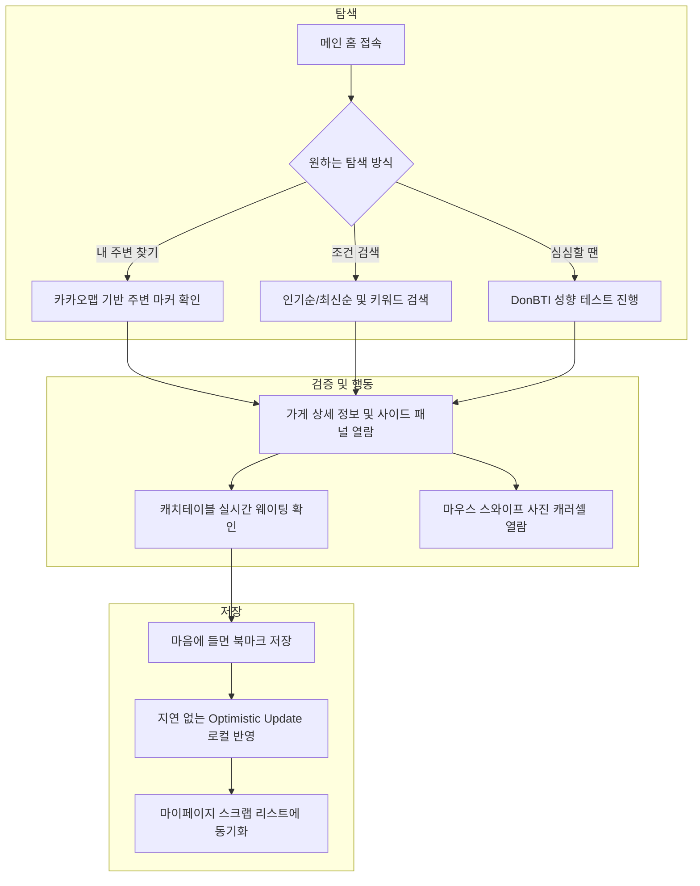
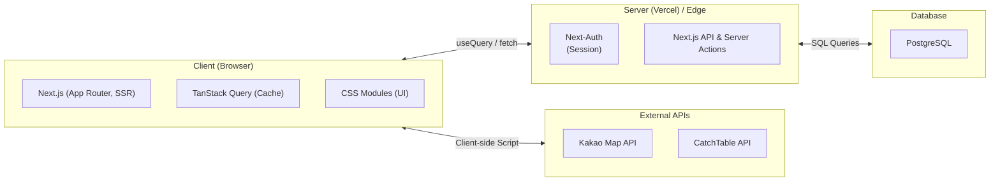

# [돈가스 맛집 큐레이션 서비스, 카츠맵(KatsuMap)](#)

    

# KatsuMap (카츠맵)

인스타그램에서 발견한 돈까스 맛집, 내 주변 위치 확인부터 실시간 웨이팅 현황까지 한 번에 제공하는 **돈까스 특화 맛집 지도 플랫폼**입니다.

**개발 기간:** 24.05 ~ 24.09 (이후 UI/UX 및 아키텍처 리팩토링 진행) | **개발 인원:** 1인 (개인 프로젝트)

## 💡 이런 서비스입니다

`"인스타그램에서 본 맛집, 지금 내 위치에서 얼마나 멀지? 대기는 얼마나 될까?"`

**카츠맵**은 파편화된 맛집 정보 탐색의 불편함을 해결하기 위해 탄생했습니다. 검색, 지도 확인, 웨이팅 정보 확인을 하나의 흐름으로 묶어 사용자에게 빈틈없는 맛집 탐방 경험을 선사합니다.

### 핵심 가치

- 🗺️ **직관적인 지도**: 카카오맵 기반으로 내 주변 돈까스 맛집을 한눈에 파악합니다.
- ⏳ **실시간 대기시간**: 캐치테이블 연동으로 매장에 가기 전 미리 웨이팅 현황을 체크합니다.
- 📍 **나만의 맛집 저장소**: 가장 가보고 싶은 식당들은 북마크 탭에 저장해 두고 나중에 쉽게 찾아볼 수 있습니다.
- 🎲 **재미있는 탐색**: 'DonBTI(돈BTI)' 테스트를 통해 내 취향에 딱 맞는 돈까스를 추천받습니다.

---

## 🎯 이런 분들을 위한 서비스입니다

- 인스타그램이나 블로그에서 맛집 위치와 리뷰를 **따로 찾아보는 것에 지친 분**
- 지금 당장 내 주변에서 **가장 인기 있는 돈까스집**을 빠르게 찾고 싶은 분
- 식사 시간에 매장 앞 **긴 웨이팅을 피하고** 효율적으로 움직이고 싶은 분

---

## 기존 서비스와의 차별점

| 기존 서비스 패턴  | 한계점                                    | **카츠맵 (KatsuMap)**                                  |
| ----------------- | ----------------------------------------- | ------------------------------------------------------ |
| 인스타그램 / SNS  | 위치 파악 어려움, 실시간 웨이팅 정보 부재 | **카카오맵 연동 및 캐치테이블 현황 즉시 확인** ✅      |
| 일반 종합 지도 앱 | 수많은 식당 혼재, 큐레이션 부족           | **오직 돈까스 매니아를 위한 특화 큐레이션 및 정렬** ✅ |
| 단순 맛집 리스트  | 개인화된 즐겨찾기 및 탐색의 재미 부족     | **DonBTI 추천, 빠른 북마크, 트렌디한 카드 UI** ✅      |

---

## 주요 기능

### 1️⃣ 내 주변 돈까스 맛집 지도 (Kakao Map API)

현재 위치 기반으로 주변의 돈까스 가게들을 지도에 마커로 표시합니다.
데스크탑에서는 **사이드 패널**, 모바일에서는 **스와이프 바텀 시트** 로 반응형 UI를 제공합니다.

### 2️⃣ 캐치테이블 실시간 웨이팅 연동

별도의 앱을 켤 필요 없이, 카츠맵 상세페이지 내에서 특정 가게의 **현재 웨이팅 팀 수**를 API 베이스로 실시간 확인합니다.

  

### 3️⃣ 빠르고 끊김없는 맛집 저장 (나만의 북마크북)

로그인한 유저는 북마크 기능을 통해 마음에 든 식당들을 `마이페이지`에 언제든 모아두고 꺼내볼 수 있습니다.

  

### 4️⃣ DonBTI (취향 맞춤 돈까스 추천)

간단하고 재미있는 취향테스트를 통해 사용자 취향(바삭함, 육즙 등)에 맞는 돈까스를 분석하고 맞춤 돈까스 맛집을 추천합니다.

 

---

## 🧑‍💻 사용자 시나리오

---

## ⚙️ 시스템 아키텍처 및 기술 스택

### Architecture Overview

### 🛠️ Tech Stack

#### Frontend & Server

  
  
  
  
  
  

#### Backend & Infra

  
  

---

## 주요 기술적 성과 및 고민

- **1인 풀스택 개발 및 배포 생애주기 완료 (Next.js) :**
  기획부터 디자인, 데이터베이스(PostgreSQL) 설계 관리, 백엔드 API 연동, 프론트엔드 UI 구축, 그리고 Vercel을 통한 자동화 배포까지 100% 혼자 힘으로 구현해 냈습니다. 프로젝트 전 주기를 직접 경험하며 End-to-End 서비스 개발에 대한 자신감과 아키텍처에 대한 깊은 이해를 얻었습니다.
- **비공식 API 리버스 엔지니어링을 통한 서비스 가치 창출 (CatchTable) :** 캐치테이블에서 오픈 API를 제공하지 않는 제약 상황을 극복하기 위해, 웹 플랫폼의 네트워크 탭을 직접 파헤치고 분석했습니다. 개발자 도구를 통해 숨겨진 요청/응답 구조와 Authorization 헤더 패턴을 역추적했고, 필요한 웨이팅 식별 데이터를 추출하는 자체 통신 로직을 구축하여 '실시간 웨이팅 현황'이라는 핵심 비즈니스 기능을 성공적으로 띄웠습니다.
- **Next.js 기반 SEO 최적화 및 초기 렌더링 극대화:**
  기존 CSR 한계를 뛰어넘어, 사용자가 검색 엔진을 통해 유입되기 좋도록 SSR 기반의 아키텍처를 채택하여 성능과 검색 친화성을 동시에 잡았습니다. (Next.js App Router 활용)
- **낙관적 업데이트(Optimistic Update) 적용:**
  네트워크 딜레이를 숨겨 유저에게 즉각적인 응답을 주기 위해 TanStack Query의 `onMutate`를 사용하여 로컬 캐시를 선반영하고, 에러 시 롤백하는 로직을 구축했습니다.
- **반응형 하이브리드 UX 분리:**
  지도 마커 클릭 시 모바일 환경에서는 `react-use-gesture`와 `react-spring`을 결합한 스무스한 **스와이프 바텀 시트**를 제공하고, 데스크탑 웹 환경에서는 우측에서 튀어나오는 미려한 **사이드 패널** 구조를 독자적으로 분리 렌더링하여 환경별 최상의 인터랙션을 구현했습니다.
- **엄격한 컴포넌트 모듈화 & 렌더링 최적화:**
  비즈니스 로직(Custom Hooks)과 UI를 철저하게 분리하고, 불필요한 Map Marker들의 재렌더링 병목을 `useCallback`과 `React.memo`로 통제하여 프레임 드랍(Frame-drop) 이슈를 해결했습니다.

---
